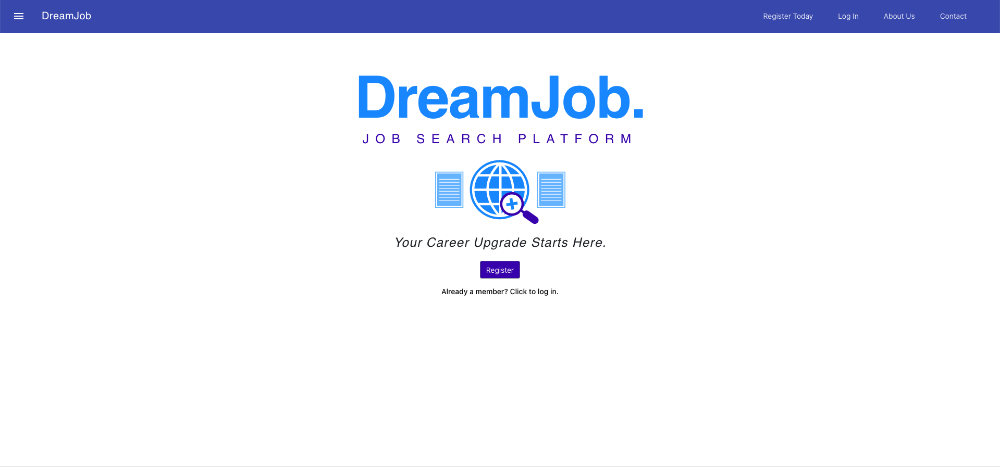

# DreamJob

A user-based job search platform to help users organize and manage their job search. Users can find and apply for jobs, and save search parameters to easily be able find most recent job advertisements. 
Users can track an application, organizing key information such as status, point-of-contact information, last communication data, interest level and notes. 



**Deployed Application:** (https://dreamjob2.herokuapp.com/)

## Getting Started

These instructions will get you a copy of the project up and running on your local machine for development and testing purposes.

### Prerequisites

Please ensure all of the following prerequisites are installed on your local development machine:

* Git - [Download & Install Git](https://git-scm.com/downloads). OSX and Linux machines typically have this already installed.

* Node.js - [Download & Install Node.js](https://nodejs.org/en/download/) and the npm package manager. If you encounter any problems, you can also use this [GitHub Gist](https://gist.github.com/isaacs/579814) to install Node.js.

* MongoDB - [Download & Install MongoDB](https://www.mongodb.com/try/download/community), and make sure it's running on the default port (27017).

### Download

There are two ways you can get the code:

### Cloning The GitHub Repository
The recommended way to get DreamJob is to use git to directly clone the [DreamJob] repository:

```bash
$ git clone https://github.com/AlexSm2020/final-project.git DreamJob
```

This will clone the latest version of the DreamJob repository to a **DreamJob** folder.

### Downloading The Repository Zip File
Another way to use the DreamJob code is to download a zip copy from the [master branch on GitHub](https://github.com/AlexSm2020/final-project/archive/master.zip). You can also do this using the `wget` command:

```bash
$ wget https://github.com/AlexSm2020/final-project/archive/master.zip -O final-project-master.zip; unzip final-project-master.zip; rm final-project-master.zip
```

Don't forget to rename after your project name.

### Install

Once you've downloaded and installed prerequisites, you're ready to begin install process. 

The project comes pre-bundled with a `package.json`file that contains the list of modules you'll need to run the application.

To install dependencies, run this in the application folder from the command-line:

```bash
$ npm install
```
This command does a few things:
* First it will install the dependencies needed for the application to run.
* If you're running in a development environment, it will then also install development dependencies needed for testing and running your application.
* To update these packages later on, just run `npm update`

Second, you'll need to run the same command in the client folder. The client folder contains a package.json folder with the npm packages needed to support React components.

cd into client

run the following command from the command-line:

```bash
$ npm install
```


## Running The Application

Run the application using npm:

```bash
$ npm run dev
```

Your application should run client-side on port 3000 with the *development* environment configuration, so in your browser just go to [http://localhost:3000](http://localhost:3000)

The server should boot up concurrently on port 8080. Once client has compiled successfully, your browser should automatically open to port 3000 and your app should be running. 

## Running the tests

```bash
$ npm test
```

## Built With

* [React](https://reactjs.org/) - Client-side javascript library for building user interfaces
* [NodeJs](https://nodejs.org/en/docs/) - The Server-Side library Used
* [Express](https://expressjs.com/) - Server technology
* [Passport](http://www.passportjs.org/) - Secure user authentication
* [Mongoose](https://mongoosejs.com/) - MongoDB ORM

## Team

* **Andrew Murphy**
* **Aref Smiley**
* **Sedat Atakan**
* **John Rademaker**

## License

This project is licensed under the MIT License - see the [LICENSE.md](LICENSE.md) file for details